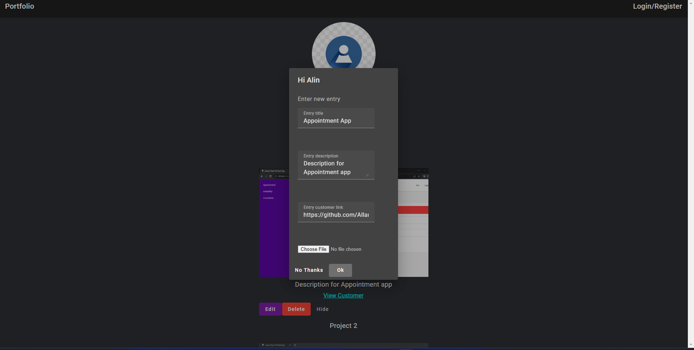

# Portfolio app


## Technologies
Project is created with:
* Angular CLI version: 15.1.6

## Setup
(For front-end)
To run this project, install it locally using npm:

```
$ cd ../frontend
$ npm install
$ npm run dev
```


## Examples

As you can see, you can create another entry



you can edit an entry starting from the original data entry


you can change your profile picture


you can delete an entry

Noted: the problem with hide is that i would want to use a back end app so i can chech the current user
the entry is marked to be hidden but because is the same user i cant show
